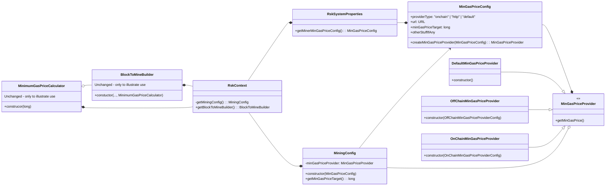

This seems unnecessarily complicated. Why should a strategy know it's type? Imo there is no need for a factory and all those different abstractions. Also there is no need to change the MinimumGasPriceCalculator. I'd simplify it to the following, given that all the information needed is known on boot-up:

